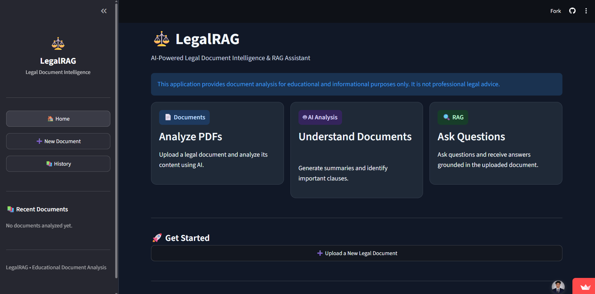
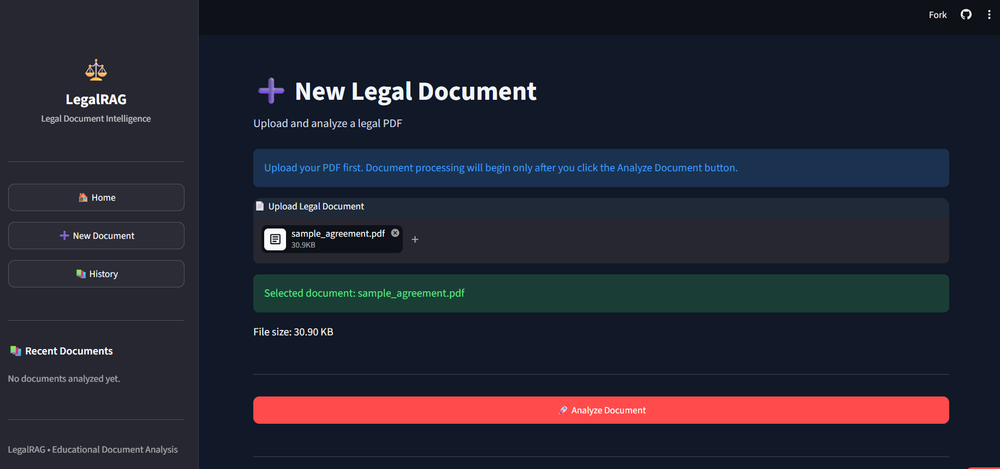
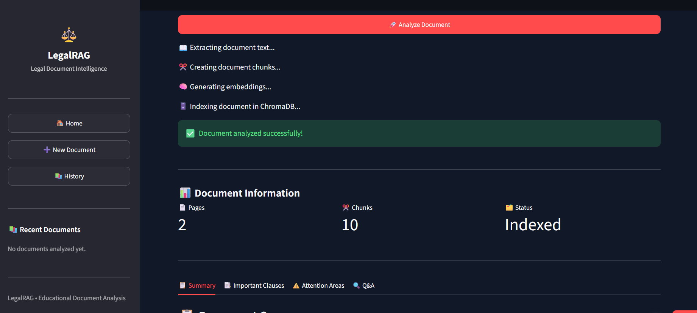
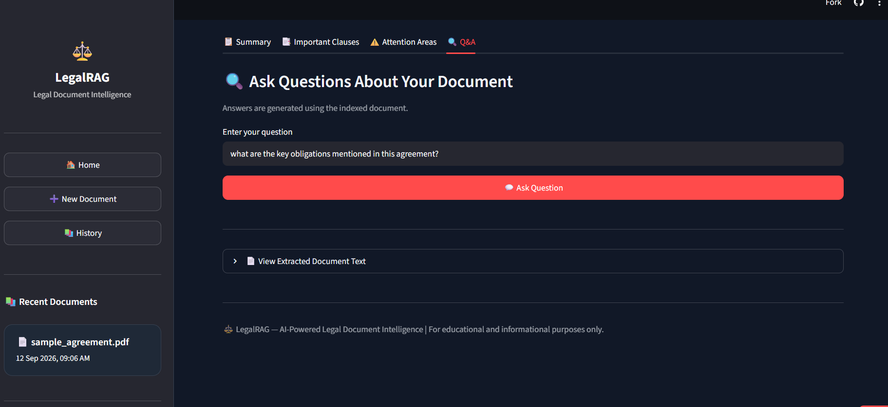
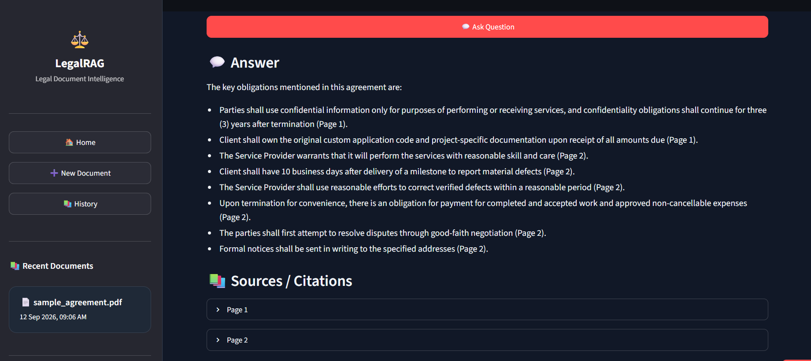

# ⚖️ AI LegalRAG

> An AI-powered Legal Document Intelligence system that uses Retrieval-Augmented Generation (RAG) and Large Language Models (LLMs) to understand and answer questions from legal documents.

## 🚀 Live Demo

👉 **[Try AI LegalRAG Live on Streamlit](https://ai-legalrag-agcesnhzedqregpmlvtj8k.streamlit.app/)**

Experience the deployed application directly in your browser.

---

## 📌 Project Overview

**AI LegalRAG** is a Legal Document Intelligence application designed to help users interact with legal documents using Artificial Intelligence.

Instead of manually searching through lengthy legal documents, users can upload a document and ask questions in natural language. The system retrieves relevant information from the document and uses an LLM to generate a clear, context-aware response.

The project combines **Document Processing, NLP, Vector Search, Retrieval-Augmented Generation (RAG), and Large Language Models** into a single application.

---

## 🎯 Problem Statement

Legal documents can be lengthy, complex, and difficult to understand. Finding specific clauses, obligations, definitions, or important information manually can take significant time.

AI LegalRAG aims to make legal-document exploration faster and more accessible by allowing users to ask questions directly about their uploaded documents.

---

## 💡 Proposed Solution

The application follows a Retrieval-Augmented Generation workflow:

1. Upload a legal document.
2. Extract and preprocess the document text.
3. Split the document into smaller chunks.
4. Convert the chunks into vector representations.
5. Retrieve the most relevant chunks for a user's query.
6. Provide the retrieved context to an LLM.
7. Generate a response based on the retrieved legal content.
8. Display the answer through an interactive Streamlit interface.

---

## ✨ Key Features

- 📄 Legal document upload and processing
- 🔎 Semantic document retrieval
- 🧠 Retrieval-Augmented Generation (RAG)
- 🤖 LLM-powered question answering
- 💬 Natural-language interaction with legal documents
- 📚 Context-aware responses
- ⚡ Interactive Streamlit web interface
- ☁️ Cloud deployment using Streamlit
- 🔐 Secure API-key handling through environment variables / Streamlit Secrets

---

## 🧠 RAG Architecture

```text
                 ┌──────────────────────┐
                 │   Legal Document     │
                 │       Upload         │
                 └──────────┬───────────┘
                            │
                            ▼
                 ┌──────────────────────┐
                 │  Text Extraction &   │
                 │    Preprocessing     │
                 └──────────┬───────────┘
                            │
                            ▼
                 ┌──────────────────────┐
                 │   Text Chunking      │
                 └──────────┬───────────┘
                            │
                            ▼
                 ┌──────────────────────┐
                 │ Embeddings / Vector  │
                 │    Representation    │
                 └──────────┬───────────┘
                            │
                            ▼
                 ┌──────────────────────┐
                 │  Relevant Context    │
                 │     Retrieval        │
                 └──────────┬───────────┘
                            │
             User Question │
                            ▼
                 ┌──────────────────────┐
                 │     LLM / Gemini     │
                 │   Response Generation│
                 └──────────┬───────────┘
                            │
                            ▼
                 ┌──────────────────────┐
                 │   Final Answer in    │
                 │   Streamlit App      │
                 └──────────────────────┘
```

---

## 🛠️ Technology Stack

| Category | Technology |
|---|---|
| Programming Language | Python |
| Web Framework | Streamlit |
| LLM | Google Gemini |
| LLM Framework | LangChain |
| RAG | Retrieval-Augmented Generation |
| NLP | Natural Language Processing |
| Embeddings | Sentence Transformers / Vector Embeddings |
| Document Processing | Python-based document processing |
| Environment Management | python-dotenv |
| Deployment | Streamlit Cloud |
| Version Control | Git & GitHub |

---

## 📁 Project Structure

```text
AI-LegalRAG/
│
├── app.py
├── requirements.txt
├── README.md
├── .gitignore
│
├── data/
│   └── documents/
│       └── legal_documents/
│
├── screenshots/
│   ├── screenshot1.png
│   ├── screenshot2.png
│   ├── screenshot3.png
│   ├── screenshot4.png
│   └── screenshot5.png
│
├── src/
│   ├── rag_pipeline.py
│   ├── llm.py
│   └── ...
│
└── tests/
    └── ...
```

---

## ⚙️ Installation

### 1. Clone the repository

```bash
git clone https://github.com/YOUR-USERNAME/AI-LegalRAG.git
cd AI-LegalRAG
```

### 2. Create a virtual environment

```bash
python -m venv .venv
```

Activate it on Windows:

```bash
.venv\Scripts\activate
```

### 3. Install dependencies

```bash
pip install -r requirements.txt
```

---

## 🔐 API Key Configuration

This project uses the Google Gemini API.

### Local Development

Create a `.env` file in the project root:

```env
GEMINI_API_KEY=your_gemini_api_key
```

**Never commit your `.env` file or API key to GitHub.**

### Streamlit Cloud

Add the following secret in the Streamlit Cloud application settings:

```toml
GEMINI_API_KEY = "your_gemini_api_key"
```

---

## ▶️ Run the Application

Start the Streamlit application with:

```bash
streamlit run app.py
```

The application will open in your browser.

---

## 📸 Application Screenshots

### 1. Home / Application Interface



### 2. Legal Document Upload



### 3. Document Processing / Retrieval



### 4. Legal Question & AI Response



### 5. Final Application Result



> Add your five screenshots to the `screenshots` folder using the filenames shown above.

---

## 🧪 Example Use Cases

AI LegalRAG can be used to explore questions such as:

- What are the key obligations mentioned in this document?
- What are the important terms and conditions?
- What rights are described in the agreement?
- What are the responsibilities of each party?
- What clauses relate to termination?
- What important information is present in the document?

---

## 🔄 Application Workflow

```text
Legal Document
      ↓
Text Extraction
      ↓
Preprocessing
      ↓
Chunking
      ↓
Embeddings
      ↓
Vector Retrieval
      ↓
Relevant Context
      ↓
Gemini LLM
      ↓
AI-Generated Response
```

---

## 🔮 Future Scope

Possible future improvements include:

- Multi-document question answering
- Advanced citation and source highlighting
- Improved legal-domain embeddings
- Conversation memory
- Multi-language legal document support
- Document comparison
- Clause-level analysis
- Legal risk and compliance analysis
- Authentication and user accounts
- More advanced evaluation and retrieval metrics

---

## ⚠️ Disclaimer

**AI LegalRAG is an educational and technical demonstration project.**

The information generated by this application should **not be considered legal advice**. Users should consult a qualified legal professional for legal interpretation, decisions, or advice.

---

## 👨‍💻 Project

**AI LegalRAG — Legal Document Intelligence using RAG & LLMs**

Built with Python, LangChain, Google Gemini, NLP, RAG, and Streamlit.

---

## ⭐ If you find this project interesting

Feel free to explore the repository, try the live demo, and star ⭐ the project.
